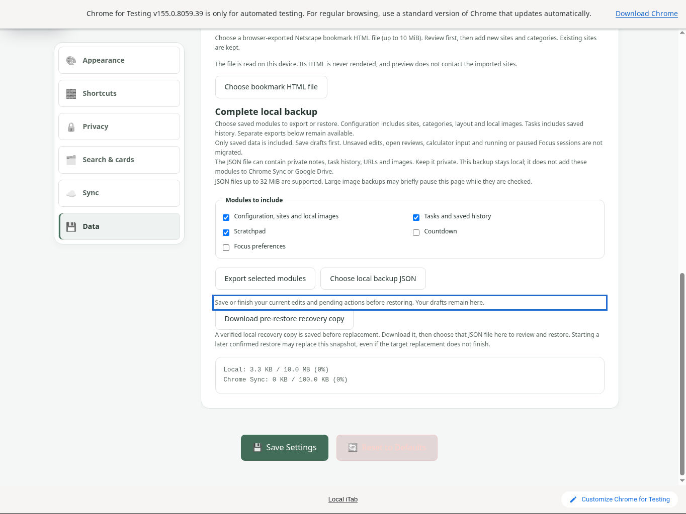
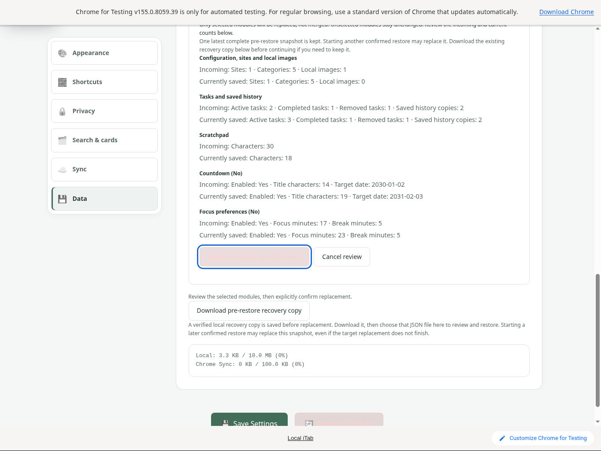
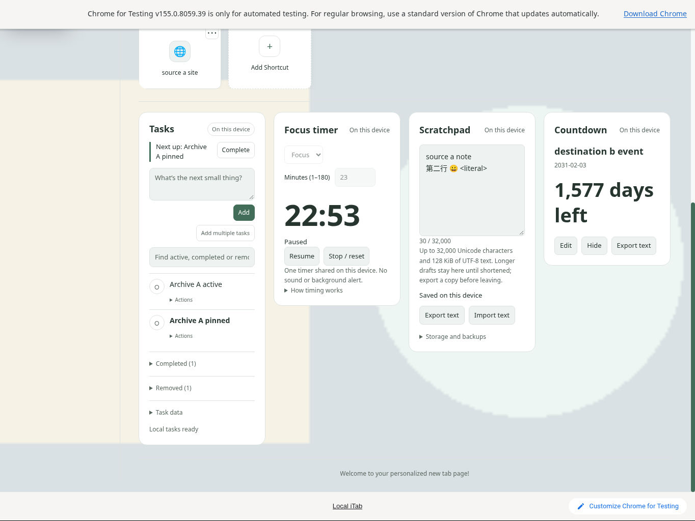
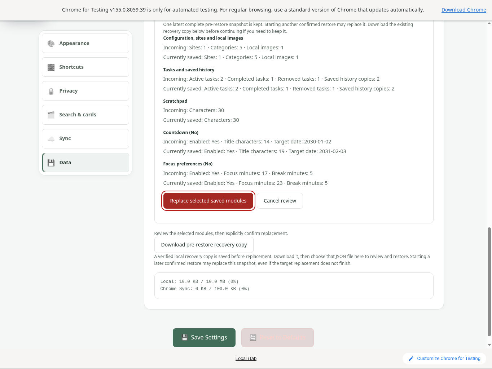
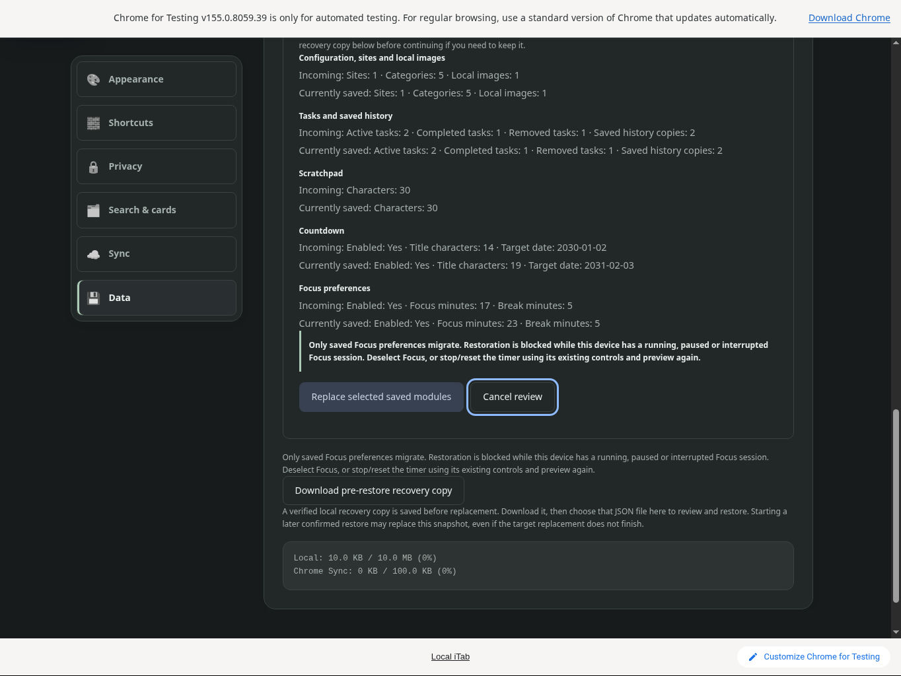
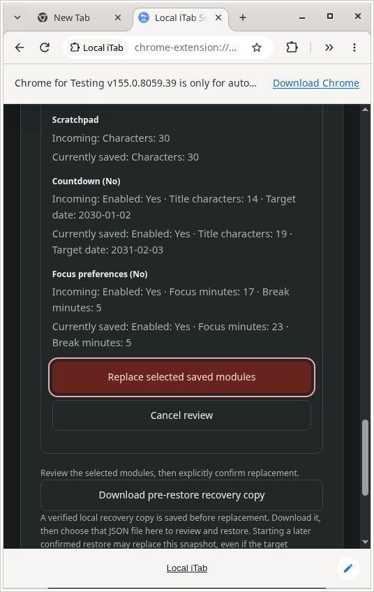
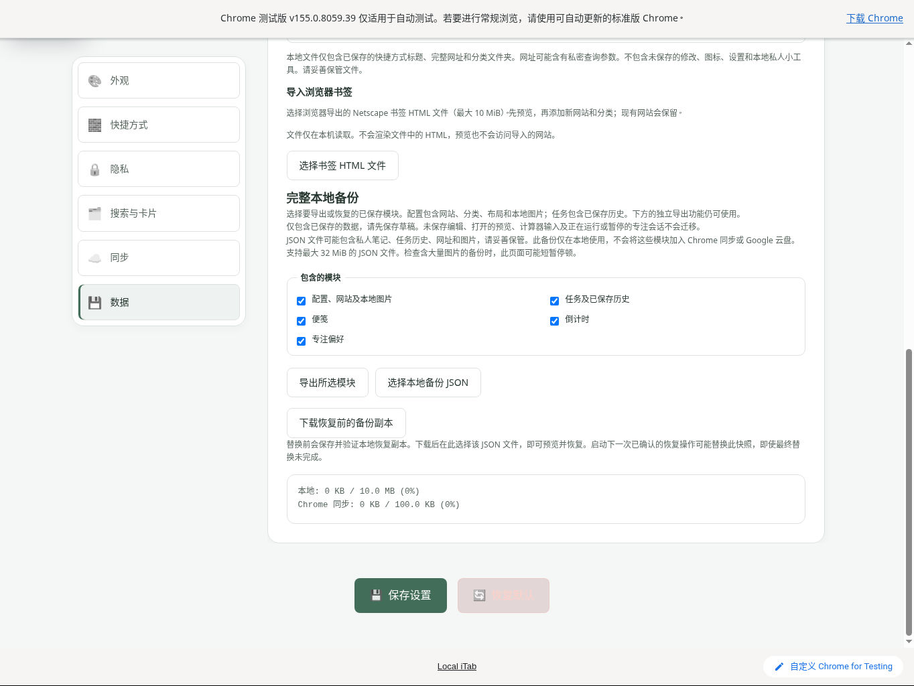

# Complete local backup: native validation

**PASS**, 2026-10-10, cloud Linux / official Chrome for Testing 155.0.8059.39. Tested an unpublished **1.1.20 + complete-backup patch** candidate based on `86bfc0003660ae63cccc96583da377460b0f4a53`, not a published release. The [initial 66-file runtime](qa/complete-backup-native/source-hashes.json) and [final two-file overlay](qa/complete-backup-native/overlay-source-hashes.json) have separate hashes.

Release integration: after this native run, the manifest was bumped from 1.1.20 to 1.1.21 and storage.js received a narrow stored-legacy compatibility fix: absent optional shortcut icon/category and category icon fields are projected without writing storage. Seven added automated regressions verify valid omissions, rejection of supplied invalid values and strict portable imports. This last storage-only fix was not replayed in the native browser; all other final runtime files match the frozen final native candidate. Documentation and release tooling were updated separately.

## Functional roundtrip

The initial frozen candidate passed this bounded native sequence:

1. Export source A: configuration, one synthetic `example.com` shortcut, five categories, an uploaded local PNG, four Tasks records (active/pinned/completed/removed) and two saved history copies, Unicode multiline Scratchpad, Countdown and Focus preferences. The exported image matches the input PNG's **1,154 bytes** exactly.
2. Create destination B using normal controls. All five portable modules differ from A. B has an additional native task, different note/date/title, no custom image, and a 23-minute Focus session paused at **22:53**. Export B before replacement.
3. Choose A in the native file picker; inspect incoming/current counts and change selections. Selecting Focus with its unfinished paused session disables Replace. Deselecting Focus refreshes the review. Escape cancels and returns visible focus to Choose file.
4. Leave an unrelated Countdown draft unsaved. Attempt a Configuration + Tasks + Scratchpad replacement with keyboard Enter. The dirty-settings refusal preserves the exact draft. After cancelling that synthetic draft normally, a full export matches all B portable modules exactly. This verifies the combined cancellation/refusal outcome, not instrumented intermediate writes.
5. Reopen A and explicitly replace only **Configuration + Tasks + Scratchpad**. Download the recovery copy, use the separate Reload action, then export C. C contains source configuration/image/note and original Task IDs/order/text/states/pin/timestamps/history. All live Task version tokens regenerate as intended. Unselected Countdown and Focus preferences remain exactly B; the native dashboard still shows Focus paused at 22:53.
6. The recovery download matches **all five B portable payloads exactly**. Downloading it does not automatically restore it.

A small Tasks fixture was generated offline with supported Store operations, then imported through the existing reviewed UI. Ordinary import into the empty enabled list retained an additional empty prior copy, explaining A's two history copies. No browser storage was seeded directly.

## Final overlay check

The initial enabled light-theme Replace button had pale text on pale fill; its original screenshot is retained. After closing Chrome, only `complete-backup.css` and `shared/complete-backup.js` were overlaid. The same isolated English profile was reopened:

- Light and dark enabled/disabled Replace states are readable. Keyboard focus is visible; Tab skips disabled Replace to Cancel. Escape closes the review.
- A real **536 × 848 native window** wraps review text and stacks controls without losing the confirmation or cancellation controls. Keyboard selection, the unfinished-Focus warning and Escape remain usable.
- A native Scratchpad-only export is **211 bytes**, contains only that module, and matches C's Unicode note exactly. Large unselected-data size boundaries were covered by automated tests, not this native run.
- A separate fresh **zh-CN** profile, selected through normal browser locale startup, shows fitted Chinese backup labels, guidance and buttons with no missing translation keys. This is a panel visual check, not a repeated Chinese replacement roundtrip.

All owned browser/file-manager windows were closed afterward.

## Evidence and repeatable comparison

Six original synthetic downloads, input fixtures, [comparison results](qa/complete-backup-native/comparison.json), [runtime hashes](qa/complete-backup-native/overlay-source-hashes.json) and [capture/browser provenance](qa/complete-backup-native/capture-metadata.json) are retained. Run:

```sh
node docs/qa/complete-backup-native/verify.cjs
```

The verifier compares downloaded payloads independently. Export time is excluded; only live Task version tokens are exempted where regeneration is expected. Recovery and unselected modules compare exactly. Screenshots below are original native captures, with no edits or redraws.

<details>
<summary>Seven original captures: initial behavior and final presentation</summary>

Initial dirty-draft refusal:



Initial enabled-button contrast defect, before correction:



After native selected restore and reload; destination Focus remains paused:



Final light enabled Replace, keyboard focus:



Final dark disabled Replace; keyboard focus skips to Cancel:



Final narrow native window, enabled Replace focus:



Final fresh Chinese profile, backup panel:



</details>

## Limits

One browser/platform; small valid local files; one paused unfinished Focus session. No native quota/32 MiB boundary, running-session variants, crash/fault injection, cross-tab races, provider/account flows or full accessibility audit. Hidden provider/authentication preservation remains automated core coverage. Focus outcomes were observed visually, without DOM inspection. Browser interactions used native mouse, keyboard and file dialogs, with no injected JavaScript or headless/debug protocol. Only synthetic content is archived; profiles and logs are excluded.
