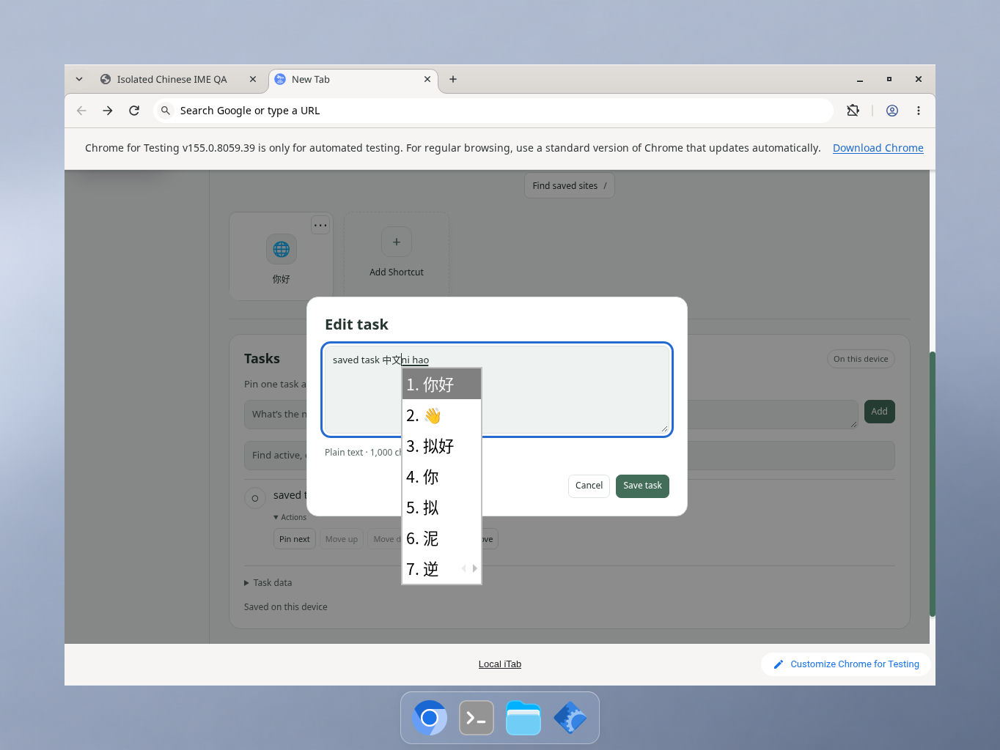
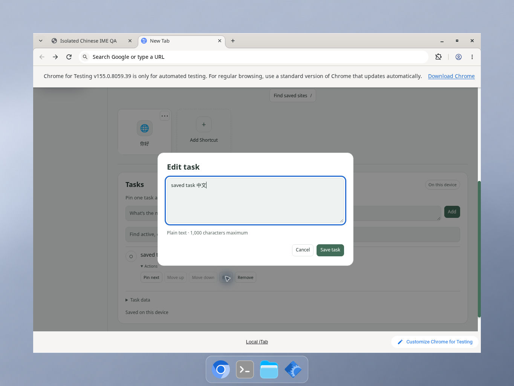

# Editor IME Escape protection

Candidate based on `39a525a0cc8b721190b88631452f04a5fe3c438d`, 2026-10-10. Only the shared dialog keyboard helper changes at runtime; no storage, permissions, manifest version, or Finder behavior changes.

## 中文

快捷方式和待办编辑器在输入法组字期间收到 Esc 时，保留对话框、焦点和未保存草稿，不阻止输入法自身处理该按键。支持 `isComposing`、旧式 `keyCode 229`，以及按键标记缺失时的 `compositionstart`/`compositionend` 状态。状态只属于当前打开的对话框；输入框失焦、移除或对话框关闭后释放，重新打开时不会沿用。组字结束后的普通 Esc 仍会关闭对话框并恢复焦点。

自动化测试使用合成 DOM/事件及实际编辑器方法，覆盖草稿、待保存操作、重开、过期清理、叠加对话框和 Tab 焦点约束。后续已在 Linux X11、Chrome 155 和真实 Fcitx5 拼音输入法中验证候选取消、草稿保留、再次 Esc 关闭及焦点恢复。macOS、Windows、其他输入法和辅助技术仍未验证。

## English

During IME composition, Escape keeps shortcut/task dialogs, focus and unsaved drafts intact without preventing the IME's own default key handling. The helper recognizes `isComposing`, legacy `keyCode 229`, and `compositionstart`/`compositionend` when the key flag is absent. State belongs to one opening and clears on field blur, removal or dialog close; it does not carry into reopening. Ordinary Escape after composition still closes and restores focus.

Automated tests use synthetic DOM/events and production editor methods, covering drafts, pending saves, reopening, stale cleanup, stacked dialogs and Tab trapping. Subsequent native checks with Linux X11, Chrome 155 and genuine Fcitx5 Pinyin verified candidate cancellation, draft retention, subsequent Escape dismissal and focus restoration. macOS, Windows, other IMEs and assistive technology remain untested.

## Español

Durante la composición con un IME, Escape conserva los diálogos de accesos directos y tareas, el foco y los borradores sin guardar, y permite que el IME procese la tecla. Se reconocen `isComposing`, el código heredado `keyCode 229` y los eventos `compositionstart`/`compositionend` si falta la marca en la tecla. El estado pertenece a cada apertura y se libera al perder el foco del campo, retirarlo o cerrar el diálogo; no se conserva al reabrirlo. Escape vuelve a cerrar el diálogo y restaurar el foco tras la composición.

Las pruebas automatizadas usan DOM/eventos sintéticos y métodos reales del editor. Cubren borradores, guardados pendientes, reapertura, limpieza antigua, diálogos superpuestos y el recorrido con Tab. Las pruebas nativas posteriores con Linux X11, Chrome 155 y Fcitx5 Pinyin verificaron la cancelación de candidatos, la conservación del borrador, el cierre con otro Escape y la restauración del foco. macOS, Windows, otros IME y la tecnología de asistencia siguen sin verificar.

## Automated evidence

- The six flagged/229/lifecycle-only shortcut/task editor regressions fail against the unchanged baseline.
- Candidate: 761 Node tests, including 17 added regressions, and 19 Python packaging tests passed without failures or skips.
- Full JavaScript syntax checks, manifest/locale JSON parsing and patch whitespace checks passed.
- Runtime-only ZIP creation and byte-for-byte verification passed (60 files). Packaging is static verification, not browser testing.
- Existing Finder composition, lifecycle, shortcut preference, dialog-focus and editor save-session tests remain passing.

Commands: `node --test tests/*.test.js`; `python3 -m unittest discover -s tests -p '*_test.py'`; the JavaScript/JSON checks in the README; `git apply --check` and `git diff --check` on the patch; `python3 tools/package_extension.py --output /tmp/protect-ime-editor-runtime.zip` and `python3 tools/package_extension.py --verify /tmp/protect-ime-editor-runtime.zip`.

## Genuine native Chinese IME follow-up

On 2026-10-10, the unchanged runtime from `85f91436900fa0deb2c6ad753d1cb5b71efb1de9` (all 60 files also identical to docs-only `6f03d9f`) passed real native Pinyin interaction in Add Shortcut, saved Shortcut Edit and Tasks Edit. Official Chrome for Testing 155.0.8059.39 ran on Debian 13, Linux X11/GTK3 with Fcitx5 5.1.12 and Pinyin 5.1.8. Signed official Debian packages were hash-verified and unpacked into a private workspace prefix; no system installation or global input setting change was needed. An isolated D-Bus session and owned browser were closed after testing.

Letters were entered with native key input, and Space selected actual Chinese candidates. In each editor, one Escape cancelled the live candidate/preedit while keeping the dialog focused and retaining already committed draft text. A second Escape closed normally, returning focus to the trigger. Reopening showed clean/original saved values, and reload retained saved fixtures without cancelled drafts. This was genuine engine input, not pasted Unicode or injected composition events.

The Tasks sequence below shows committed unsaved text followed by live Pinyin candidates, then the retained draft after the first Escape. Original 1364×1024 screenshots are unmodified.

Forty original screenshots, package provenance and runtime-integrity manifests record this bounded run. Candidate screenshot SHA256: `c848ac2a66febeb522b6db60ab07ced68c83504b036e4d41d486eb8cc5738129`; post-Escape screenshot SHA256: `3c8b06187387254300f2ed9111e70b236549270727bf3177ba2acd06342fa1b2`. A separate earlier 35-screenshot native smoke check covered ordinary Latin-input Escape, Cancel, reopen and reload in both editors.

Limits: one Linux/Chrome/Fcitx5 combination, English app UI, light Clarity template, synthetic records. Other OS/input frameworks, assistive technology, candidate selection methods, pending-save races and general stacked-dialog stress remain outside this native run. Automated event regressions remain separate evidence.
