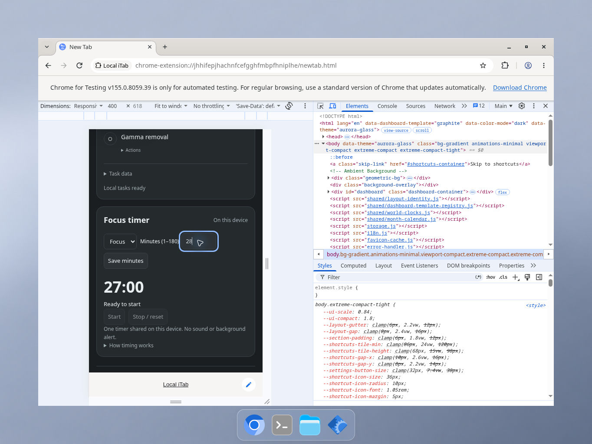

# Native narrow-template and upgrade-preservation validation

These are bounded real-browser checks on the cloud Linux desktop using official Chrome for Testing 155.0.8059.39 and synthetic local data. They do not certify all devices, assistive technology or Chrome Web Store update delivery.

## Fifteen-template narrow matrix

On 2026-10-10, each of Clarity, Graphite, Folio, Atelier, Quiet, Studio, Console, Prism, Library, Horizon, Ledger, Meadow, Blueprint, Terrace and Column was inspected at a visible 400×618 responsive viewport in dark mode. All top template/theme/settings controls, middle Finder/shortcuts/actions and lower Tasks/Focus sections remained reachable by vertical scrolling without horizontal panning. Two synthetic shortcuts, including one long title, were used. Long shortcut titles intentionally ellipsize.

A completed task's Undo survived all template switches and restored the task in Column. Graphite showed the unsaved Focus minutes control, disabled Start and the prior saved time; Save minutes updated the duration without starting. Clarity Finder opened, wrapped a long result title and closed without navigation. These were functional spot checks, not every action repeated in every template.

A detailed pixel review found a minor defect despite the initial visual pass: the shared focus outline consumed the original 6px label/input gap and touched the final parenthesis of “Minutes (1–180)”. Commit `9f1b5017ab87cc5475d1ae26cba8a02b94c75430` increases the gap to 10px without changing the focus ring or flex wrapping.

The controlled Graphite dark 400×618 before/after check confirmed visible separation. Save minutes still fit and saved without starting; a wide/light Graphite spot check also passed. Only the owned test runtime CSS was temporarily changed; after browser closure it was restored byte-for-byte and all original 60 runtime hashes matched again.

Both images are unmodified 1364×1024 native desktop JPEGs. The visible toolbar establishes the 400×618 viewport. Source hashes are in [capture metadata](screenshots/focus-spacing-1.1.7/capture-metadata.json). This corrected-state comparison is not a second full 15-template matrix. Other widths/locales and screen readers were not checked here.

## Same-profile 1.1.6 → 1.1.7 simulation

A separate owned unpacked-extension path and profile were seeded on frozen 1.1.6 through native import and editing controls. The browser was closed, only the owned runtime files were replaced with frozen 1.1.7 (`291fb22836f24deee3ea8822aabddd7e5e396d92`), and the identical path/profile were relaunched. Native extension details confirmed the same extension ID and the new version. No data import or restoration occurred after the update.

Before/after exports and native UI confirmed:

- Three shortcuts and two categories kept their exact titles, URLs, order and memberships; Graphite/dark and all prior settings remained.
- Tasks retained exact record IDs, versions, text, order, active/completed/removed states, timestamps, pin and recovery content. Only the export timestamp changed.
- Scratchpad remained byte-identical: 72 bytes, SHA256 `b2ef037eadf5d2f063e86f01db2c5ecfed211ab0cb5c552b8ce8baf597b5a6ea`.
- Saved Focus 31-minute and Break 7-minute preferences and module visibility remained. No running timer session was part of this check.
- Configuration differences were only export timestamps/version and the expected new `ui.finderShortcutEnabled: true` default. Both exports normalize to identical settings through the candidate's actual validator.
- A final reload retained the saved content. Both frozen ZIPs and all 60 candidate runtime files remained unchanged; the owned browser was closed and other desktop windows preserved.

The old archive SHA256 was `2256b00e487ccaf9ee692e69bd32e559d3f9b1ed1202236b6761554f99c06379`; the candidate archive was `9aeec8bb100b3d45b99fd7123633741ff092a6388664a3a4701b76b559149650`. The later one-line CSS spacing fix was not part of this frozen upgrade test and is covered separately above.

This is unpacked-runtime preservation evidence, not a signed store-upgrade, downgrade, cross-device migration, live Sync/Drive, crash recovery or corrupt-record test. Full integrated code checks after the spacing fix passed 725 Node tests and 19 Python packaging tests.
