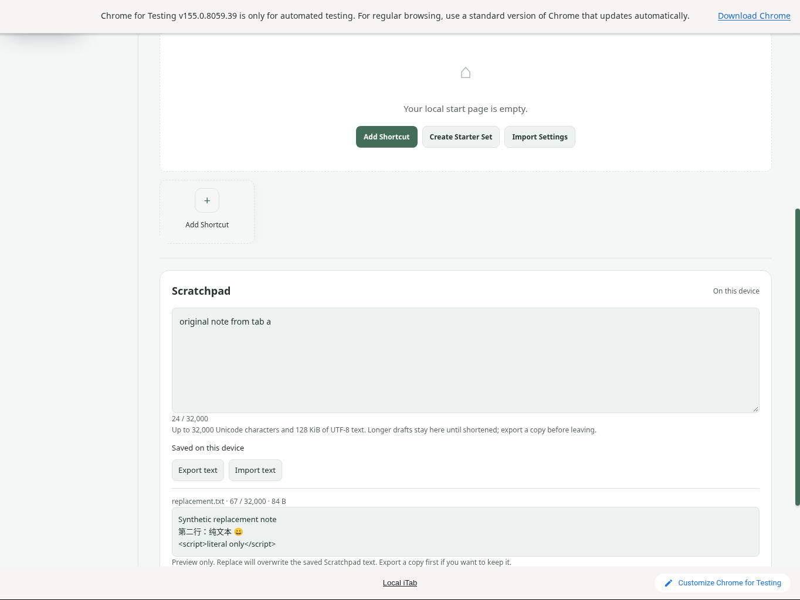
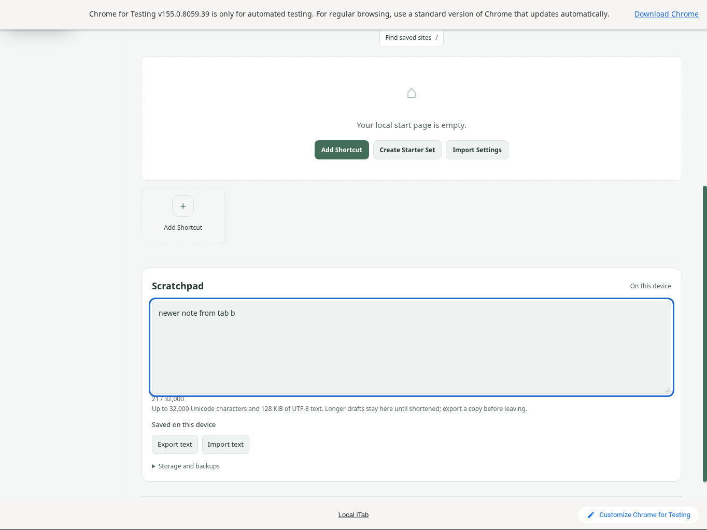
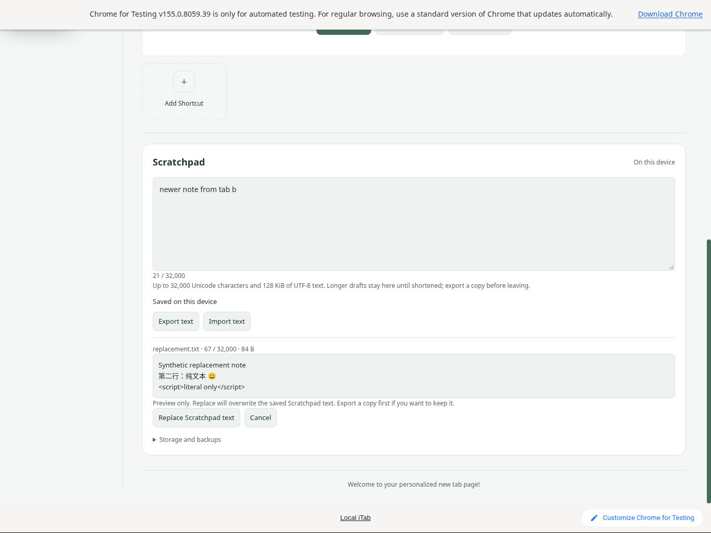
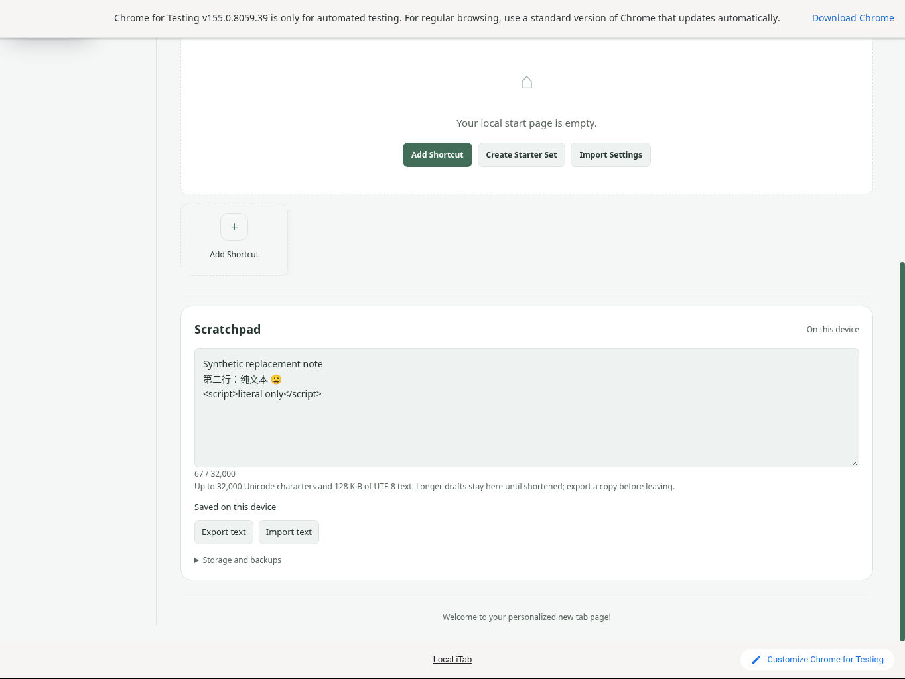

# Scratchpad TXT preview invalidation across two tabs

**PASS — public 1.1.19, 2026-10-10.** A completed TXT preview in tab A was invalidated when tab B saved a different note. The newer note survived reload and actual export. Reopening the same TXT and explicitly replacing the note then survived reload and exported byte-for-byte.

## Exact environment

Official Chrome for Testing 155.0.8059.39 on cloud Linux; fresh synthetic English/Clarity/light profile; two ordinary extension tabs. The actual public ZIP matched source `c6b6de6439b915774692a11967e58677da31df6a`, SHA256 `269dfdadc6de55b3e146739092a740ac1c18f52994becaddb27e58ddd260f7de`. All 63 runtime files matched published provenance before and after testing. [Source and evidence hashes](qa/scratchpad-cross-tab-native/source-hashes.json).

## Native procedure

1. Enable Scratchpad through Settings. In tab A, save `original note from tab a`, then select the real synthetic TXT through the native file chooser. Its preview shows 67 Unicode characters / 84 bytes, with Chinese, emoji and literal HTML. Do not apply it.
2. Open tab B, replace the note with `newer note from tab b`, and observe **Saved on this device**.
3. Return to A. The preview and its replacement action are gone; the newer saved note is visible. The textarea has a visible focus ring; Tab moves to **Export text**. Reload A and export the newer note.
4. Select the same TXT again. The fresh preview coexists with the newer saved note. Explicitly choose **Replace Scratchpad text**, observe Saved, reload and export.
5. Preserve the two actual downloaded TXT files through the native file manager and independently compare bytes. Close all owned test windows.

The newer-note export is exactly 21 bytes, SHA256 `a4c130ee922cbda7f334b6d38a3edad9e21e8d89a21ccdbf0b5728cd847b2882`. The replacement export is exactly the 84-byte input, SHA256 `6a60d6557e09a851a62a6262b5158eab8f1359c194740788a1ab9d54f03f64b2`. Run `node docs/qa/scratchpad-cross-tab-native/verify.cjs` to repeat the artifact comparisons. [Results](qa/scratchpad-cross-tab-native/comparison.json) and synthetic fixtures/downloads are retained alongside the verifier.

## Original native captures

Tab A's first preview leaves the original saved note unchanged:

After tab B saves, A shows the newer note with usable editor focus and no stale preview:

A newly selected file requires explicit replacement:

The explicitly imported text survives reload:

## Limits

This establishes the ordinary **observed cross-tab saved-change** path, not an unseen compare-and-swap race, simultaneous writes, delayed file reads, storage faults, IME, screen-reader behavior or all focus combinations. One locale/template/viewport and LF fixture were used; BOM/CRLF/CR remain model-tested as described in [TXT import validation](scratchpad-import-validation.md). Native AX was X11-only; focus claims come from visible rings and keyboard behavior. No browser injection, debug endpoint, headless mode, account, provider or user-computer access was used. Online features stayed at fresh-profile defaults; browser background networking was not measured. Runtime and repository source were not changed; profiles, logs and private paths are excluded from this archive.
