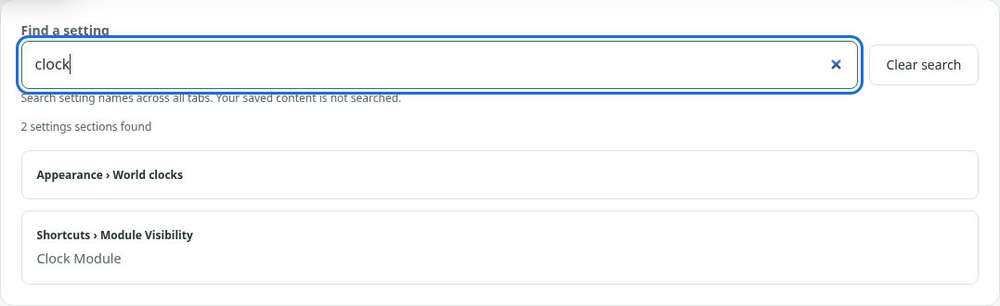
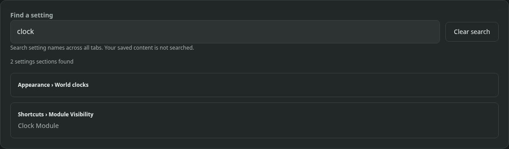

# Find a setting / 查找设置

## English

Use **Find a setting** above the Settings tabs to search section and control names
across all six tabs. Try **World clocks**, **Free placement**, **Scratchpad**,
**favicon**, or **Import browser bookmarks**. Results show their tab and section,
plus matching control names when available.

Typing keeps you in the current tab. Click a result, or use Tab to focus a result
and Enter/Space to open its section. Focus moves to the section heading or module
settings group. Conditional controls stay conditional; search never enables a
module or presses an action button. Use **Clear search** to clear the query and
return focus to the search box without changing the current tab.

Only built-in setting labels in the current UI language are searched. The query
is temporary and stays on this page. Saved content, field values, category names,
computer names, URLs, credentials, Tasks, Scratchpad text and Countdown content
are excluded. Search does not save or reload settings. Existing field autosave
still works normally when you finish an edit and leave the field.

## 中文

设置标签页上方的「查找设置」可搜索六个标签页中的设置区域和控件名称。
输入当前界面语言中的设置名称，然后点击结果，或按 Tab 将焦点移到结果并按
Enter／空格，即可打开对应区域。结果同时显示所属标签页和匹配的控件名称。

输入搜索词不会自动切换标签页。打开结果后，焦点移到区域标题或模块设置组；
不会启用模块、执行按钮操作，或强制显示有条件的控件。「清除搜索」会清空搜索词，
将焦点移回搜索框，并保留当前标签页。

搜索只使用内置设置名称，不读取已保存内容、输入值、分类名、电脑名、网址、凭据、
任务、便签正文或倒计时内容。搜索词仅临时保留在当前页面，不会保存或联网发送。
搜索不会重新加载或保存设置；已有字段的自动保存仍按原来的方式工作。

## Actual screenshots / 实际截图

English Settings search in light and dark mode, captured in the actual unpacked
extension. These are exact panel crops, not full-window screenshots or mockups.

真实扩展中的英文浅色与深色设置搜索。图片仅裁剪实际搜索面板，未缩放或重绘。

[Capture metadata / 截图信息](screenshots/settings-search/capture-metadata.json)
