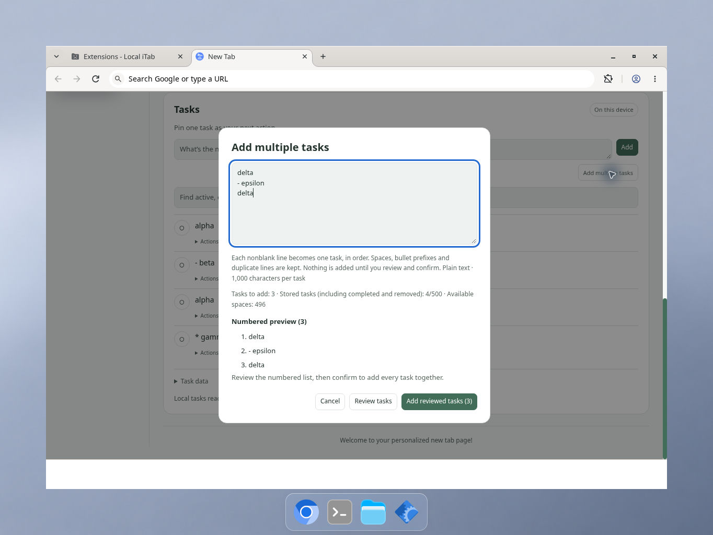
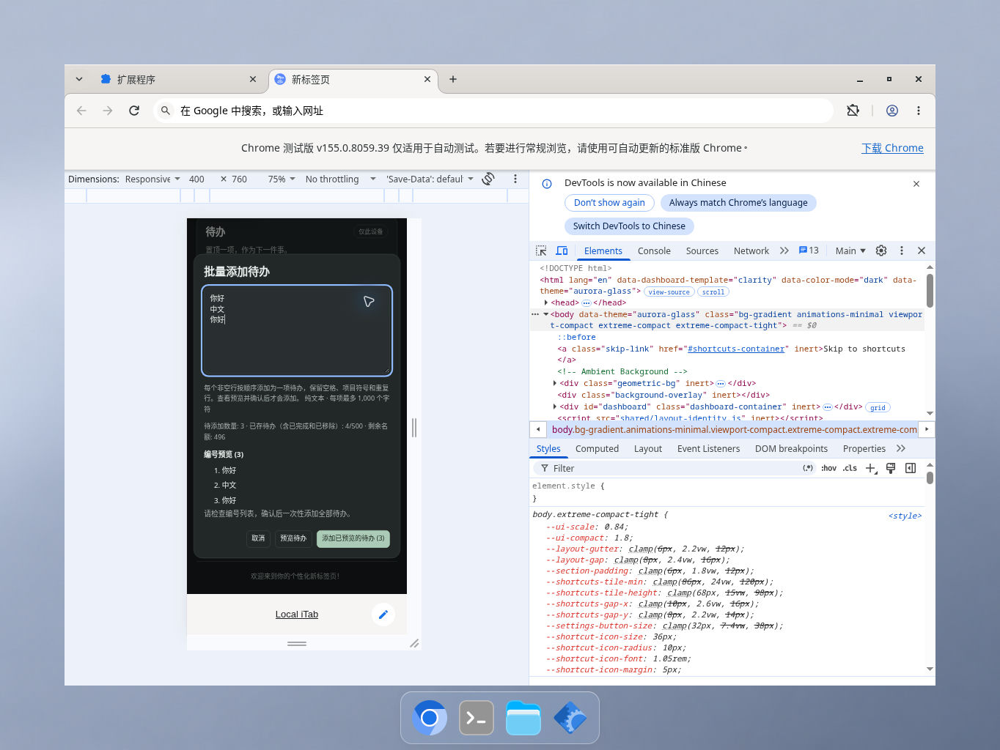

# Reviewed batch task capture — 2026-10-10

## Scope and behavior

A secondary **Add multiple tasks** action opens a plain-text editor, followed by an explicit numbered review and confirmation. Every nonblank CRLF/LF/CR-separated line becomes one task, in order. Nonblank lines are preserved verbatim, including spaces, bullet prefixes, duplicate text, markup-like text and Unicode. The ordinary Add composer still creates one task, with Shift+Enter for newlines. Opening, reviewing and cancelling a batch do not change the ordinary Add draft, task filter, saved records or pin.

The review reports the exact number to add, total stored records (including completed/removed) and available record capacity. It validates the entire prospective state without writing. Editing invalidates that preview; an observed newer list revision requires another review. Confirmation refetches the latest state under the existing exclusive task lock and appends the whole batch in one write, or adds nothing. Unobserved concurrent valid changes are preserved; capacity and full-state size are rechecked at commit.

The existing limits stay unchanged: 500 total records, 1,000 Unicode codepoints per task, eight recovery copies and a 2 MiB task file budget. Persisted state retains the existing 4 KiB safety reserve below that byte budget. Recovery content, receipts and task metadata count toward the state limit. No schema, settings, account, permission, provider or backup-format changes are made. Separate Tasks export/import includes the added records as ordinary v1 tasks.

Each reviewed command captures immutable task text, IDs, versions, creation time and operation ID. Retry uses the identical command after read, write or verification failures, including when the user has typed a newer draft. The previous batch stays visible in the retry preview; the newer draft cannot be reviewed until that retry resolves or reports a conflict. An acknowledged older operation requires review after another mutation. Stable IDs also prevent replay when a receipt has expired but the records remain in the list or recovery copies.

A newer draft survives a late success; a dismissed or destroyed dialog cannot receive stale content/focus changes. Closing a dialog does not cancel a write that has already started. Drafts are volatile and are not stored by Cancel or page closure. Open review/edit dialogs and pending writes reuse the existing Tasks reload/departure guard and IME-safe focus helper. The saved visibility preference is preserved if another page hides Tasks while its batch dialog is open.

## Automated verification

- `node --test tests/*.test.js`: 824 passing tests, no failures or skips.
- `python3 -m unittest discover -s tests -p '*_test.py'`: 19 passing tests.
- Syntax checks for root/shared/test/helper/assets JavaScript and JSON parsing for manifest/all catalogs pass.
- Runtime-only ZIP creation and byte-for-byte verification pass: 60 runtime files. The ZIP is a disposable ignored test artifact, not a store submission or version change.
- `tests/local-tasks-batch-store.test.js`: 20 focused tests cover exact parsing, immutable read-only review, all-or-zero invalid/capacity/byte rejection, existing done/removed records, all eight recovery copies, lock-wait races, concurrent batches/edits/pin changes, quota/read/write/verification failures, safe receipt retries, expired receipts, controller coalescing and exact v1 backup roundtrip.
- Real Chrome-storage/Web-Lock adapters under a model also verify batch preview makes no writes, confirmation writes only the personal Tasks key once, and both batch sentinels remain excluded from settings/Drive/Sync/recovery payloads with Sync enabled or disabled; settings restore preserves them. No live provider account or traffic is involved.
- `tests/local-tasks-batch-view.test.js`: 43 actual-view model tests cover English/Chinese labels, accessible dialog/control naming, numbered text-safe previews, exact counts, cancellation, ordinary Add/Shift+Enter, drafts/filters/pins, stale review callbacks, newer drafts, close/reopen/destroy, cross-tab changes with/without notifications, late capacity rejection, immutable retries after five failure paths, old acknowledged conflicts, IME Escape/blur, focus trapping, repeat/double activation, remote hiding, and a newer controller mutation before the old promise continuation.

Normal batch loading, review-ready, saving and draft-preserved feedback uses the muted status color; only actual validation/read/write/verification failures use the error color. Three additional actual-view/style regressions verify this distinction without changing other dialogs.

Independent read-only review found no substantive defect and passed five additional ephemeral probes for overlapping reviews, late old review failure and remote-hide cancel/success/failure (816 total tests in that review copy). Those five probes are not counted in the initial 811-test archive suite.

Negative assertions check that failing validation produces zero storage writes and no valid-prefix additions; failed or uncertain saves do not claim confirmation or discard the draft. The tests exercise actual store/controller/view modules using serial-lock, storage and DOM models. Existing Tasks regression tests continue to pass.

Native pre-release testing additionally found that Chrome loses keyboard focus when a focused action is disabled during asynchronous review. Batch controls now transfer only their own focus to the same open editor before becoming disabled or hidden. Ten additional regressions use an opt-in disabled/hidden-control blur model and route keys through the actual active element. Six targeted negative probes fail against the preceding implementation and pass with the fix. Native revalidation is recorded separately below when complete.

## Native Chrome verification

The actual unpacked extension was tested on the assistant's cloud Linux desktop using official Chrome for Testing 155 and native keyboard/mouse input. The original candidate exposed the focus-loss defect above and incorrectly colored normal feedback as an error. Both were fixed before publication and rechecked in the actual extension.

- Keyboard Tab → Review → Enter → immediate Escape closes the fixed dialog and restores its trigger. Empty-input review keeps focus and shows a real error; immediate Escape also closes correctly.
- Explicit Cancel leaves the saved list unchanged. Confirmation adds every reviewed line in order, retaining duplicate text and bullet prefixes, without changing the ordinary Add draft or active filter. Reload retains the saved records.
- English/light and Chinese/dark narrow review dialogs were checked with DevTools' visible 400 × 760 responsive setting at 75% preview scale. Text, counts, editor, numbered preview and actions were readable/reachable in these states. Browser-owned footer space means this is not a separately measured 400 × 760 inner application viewport.
- Genuine private Fcitx5 Pinyin input committed Chinese multiline text and duplicates. The first Escape cancelled active preedit without dismissing the dialog or losing committed text. Explicit confirmation added the three Chinese tasks after the original four, retaining order and duplicate text.
- The original and fixed 60-file runtime inventories, screenshot hashes and test notes are retained with the native evidence. The two screenshots below are original desktop captures, not reconstructed UI.

## Verification limits

The native run covers the stated Linux Chrome/Fcitx5 combination and representative states, not every OS, assistive technology, template, width, task capacity or failure mode. Quota, concurrency and byte-limit failures are automated model coverage rather than live provider/storage fault injection. No live provider account or network-traffic verification was added for this feature.

Chrome showed two error-9 renderer crashes around a DevTools resize/restart during concurrent test activity; visible reload recovered the profile and retained the four saved records. Resource pressure is possible but not proven. These events are retained in the native report rather than omitted or attributed to application code without evidence.

The same native run separately identified an existing ordinary Tasks Edit validation/focus issue. Its repair is a separate change and is not claimed as fixed by this batch feature.
