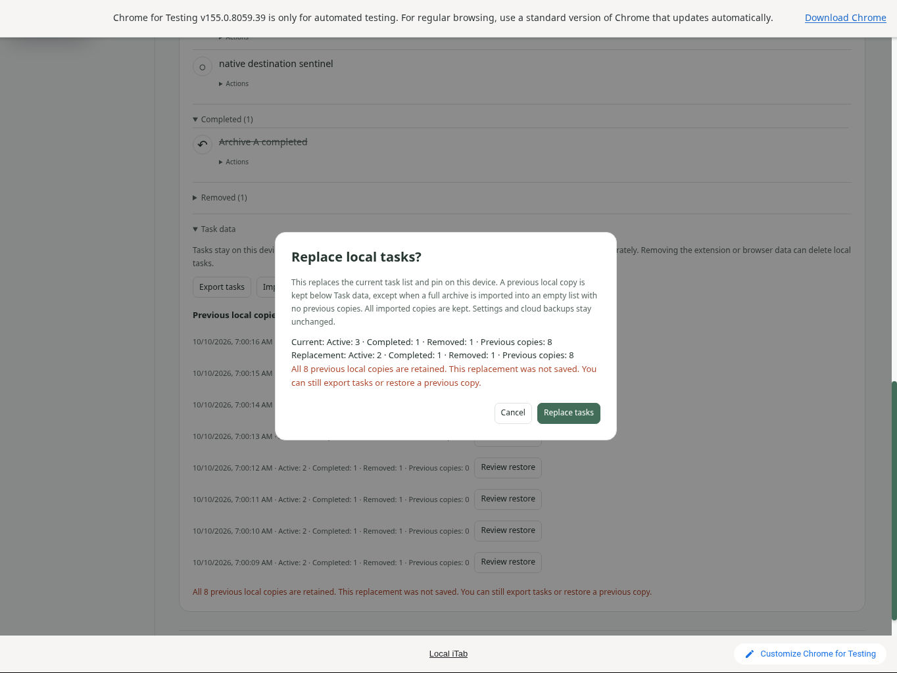
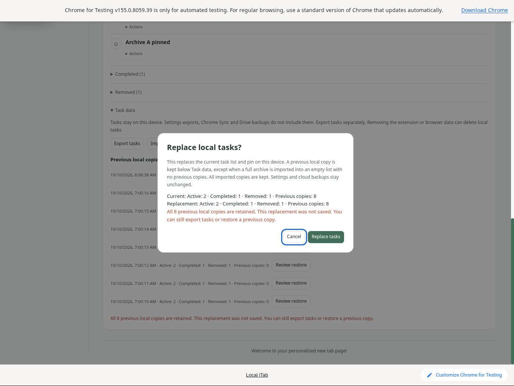
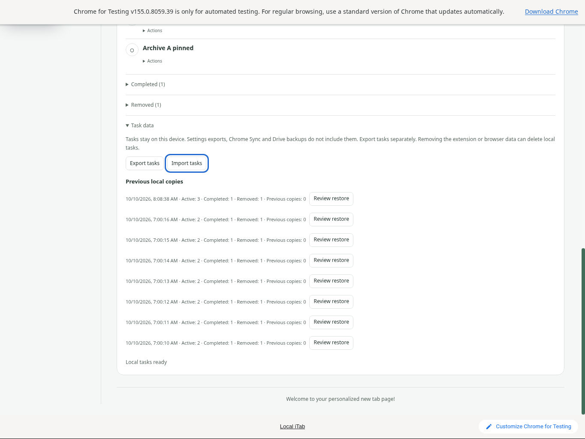
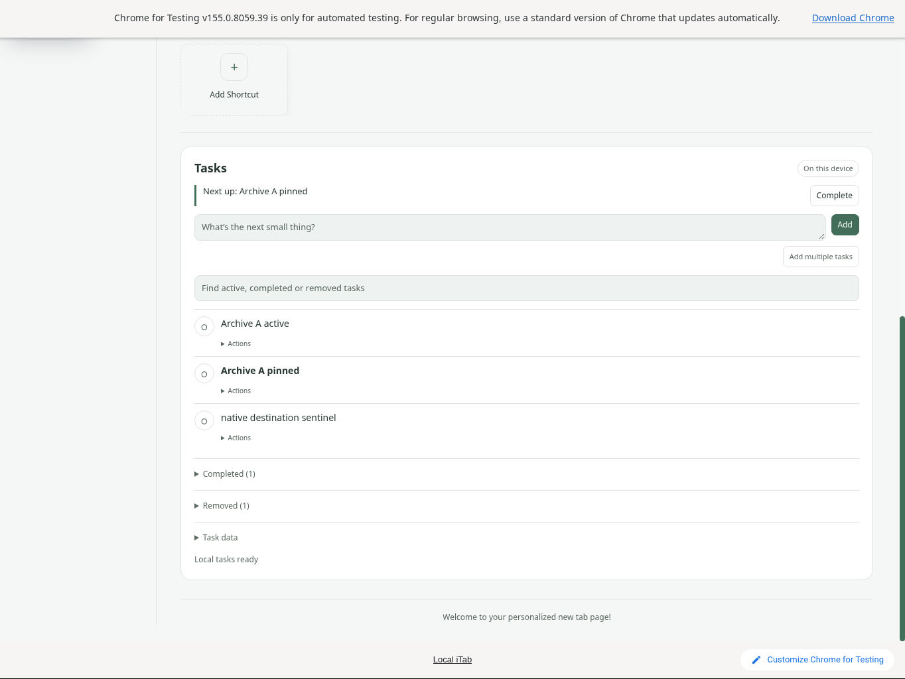

# Tasks recovery: capacity protection and keyboard focus

Native cloud-Linux checks on 2026-10-10 reproduced a keyboard defect in public **1.1.18** and verified the one-file candidate correction. This test used official Chrome for Testing 155.0.8059.39, one disposable English/Clarity/light profile and synthetic content only. No browser injection, debug endpoint, headless mode, account or live provider was used.

## Exact builds

The downloaded public ZIP matched source `14acaaaf81256a340bacb72b6d6bf3fb267c8aea` and all 63 published runtime hashes. The candidate was **1.1.18 + the Tasks recovery-focus patch**, not a published 1.1.19 build. Only `shared/local-tasks-view.js` differed, SHA256 `0e654efbaddc2f2381f80b63e2bd996c84f034aba37c4f4ef01334877ad5bd29`; the public runtime was preserved separately. [Source, artifact and capture hashes](qa/tasks-recovery-focus-native/source-hashes.json).

## Bounded procedure and result

1. Import a synthetic eight-copy archive into an empty profile using the native file chooser and explicit review. The fixture came from the actual Store's supported operations and export. It includes active, pinned, completed and removed tasks plus a distinct older B copy. Add a native sentinel task, then export the nonempty destination before testing replacement.
2. Review and cancel: the real downloaded export has exactly unchanged records, pin and all eight copies.
3. Review again, Tab to **Replace tasks**, then Enter. Capacity refusal correctly preserves all data. On public 1.1.18 the visible focus ring disappears and immediate Escape leaves the modal open; pointer Cancel works. Escape before confirmation had closed normally. Native AX exposed only X11, so no specific DOM active element is claimed.
4. Explicitly restore B at capacity, then reload and export. B's identities, order, text, states, timestamps and pin match; live versions regenerate. The other seven copies are exact, and the entire prior destination with sentinel is retained as the new eighth copy.
5. Close Chrome, apply only the candidate view patch at the same extension location, and reopen the same disposable profile. Export confirms unchanged startup data. Repeat keyboard refusal: **Cancel** visibly retains focus, immediate Escape closes, and focus returns to **Import tasks**. Its export is exactly unchanged.
6. Explicitly restore the preserved A destination through the candidate review, reload and export. A plus sentinel returns; B is retained exactly as the new eighth copy and the other seven remain exact.

[Offline verification script](qa/tasks-recovery-focus-native/verify.cjs) checks all seven original native JSON exports and evidence hashes. Run `node docs/qa/tasks-recovery-focus-native/verify.cjs`. [Comparison summary](qa/tasks-recovery-focus-native/comparison.json), [synthetic fixture](qa/tasks-recovery-focus-native/tasks-full-eight.json), and [fixture generator](qa/tasks-recovery-focus-native/generate-fixture.cjs) are included. Export-envelope timestamps differ; content/history equality is asserted separately.

## Original captures

Public 1.1.18 after Enter refusal and immediate Escape, still open:

Candidate refusal keeps Cancel focused:

Candidate immediate Escape closes and restores Import focus:

Candidate reviewed recovery survives reload, including the native sentinel:

## Limits

One profile, locale, template and viewport; one capacity refusal per build and one existing-copy recovery per build. This is not native race/failure injection, a screen-reader certification, cross-platform coverage, a live Sync/Drive test or a test of every archive. No user data or other profile was touched. Original screenshots are unchanged 1364×1024 JPEGs; exported JSON is synthetic. Test windows were closed normally. Browser profiles, logs and desktop inventories are excluded.
