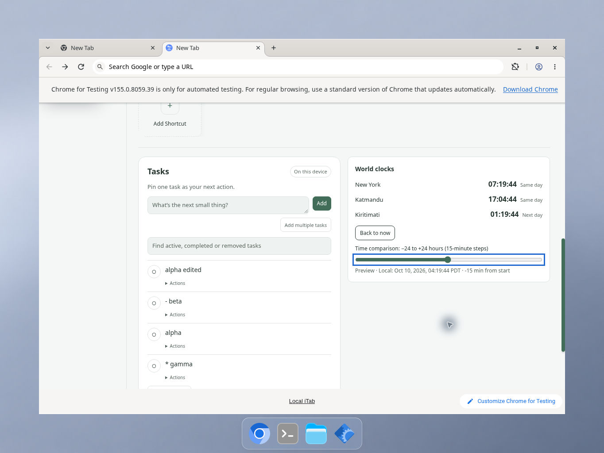
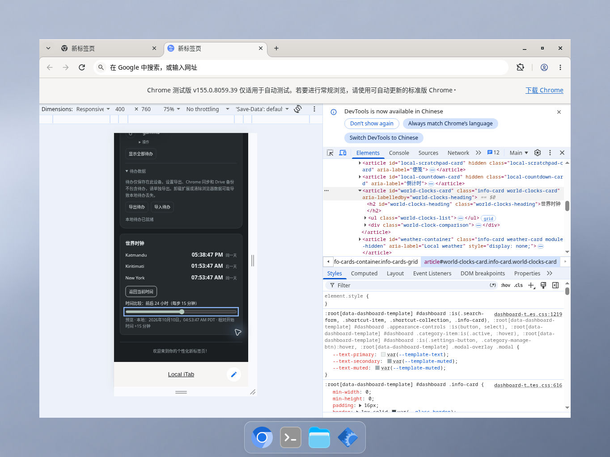

# World-clock comparison validation — 2026-10-10

## Scope

A page-local comparison control appears only for configured world clocks. Opening it captures one instant; the range applies −1,440 to +1,440 elapsed minutes in 15-minute steps. World readings and their day relationships use that fixed preview instant. The main clock, calendar and independent timers retain their live time sources. Back to now restores live readings. Reload or removal of all clocks clears comparison; ordinary clock format/template updates preserve it while the clocks remain.

No permission, schema, dependency, storage field or timer was added. Comparison does not call storage, network or provider APIs. Native range controls provide keyboard arrows/Home/End, a label, descriptive local date/time/zone and an accessible value. Retired or detached controls cannot modify a later comparison. The range accent follows the selected theme.

## Automated verification

Six actual-component tests exercise shipped newtab.js with the existing Intl world-clock helper and a DOM/event model. Cases include capture/non-drift, limits/quantization, invalid input, 12/24-hour and seconds settings, date-line and fractional-hour zones, spring/fall DST, empty/removal/replacement, stale controls, locale/configuration refresh, focus/state preservation and unchanged main-clock interval ownership. I/O globals throw if comparison accesses them.

Independent review found and repaired a discarded-control listener edge case. It separately exercised the real calendar helper across midnight: the live today marker advanced while the comparison stayed anchored. Thirty-seven related review tests passed. These models do not establish native layout or screen-reader behavior.

The implementation-only archive passed a 767-test serial suite and 19 Python tests. A concurrent repeat had an untraced scale-test process failure; its isolated test passed. A later repeat was intentionally interrupted to release resources for native testing. Those interrupted/failed runs are not represented as passing. The independently run consolidated production suite passes 841 Node tests serially, with zero failures/skips, and all 19 Python tests. JavaScript syntax, manifest/catalog JSON and the runtime-only 60-file ZIP checks also pass.

## Native Chrome verification

Official Chrome for Testing 155 on the assistant's cloud Linux desktop, unpacked extension with synthetic local data, native clicks/keys only. New York, Kathmandu and Kiritimati were configured through Settings.

- English/light wide comparison displays the local reference and correct same/next-day hints.
- Main clock visibly advanced from 04:34:22 to 04:34:35 while preview world-clock seconds remained fixed at :49.
- Keyboard arrows change 15 minutes; Home/End reach −1,440/+1,440. Pointer input, Back to now, resumed live seconds and fresh recapture work.
- Template switching and a separately saved 12-hour format preserve the captured preview/offset. Removing all clocks hides the card; adding them again starts live.
- Chinese/dark narrow comparison at the visible 400 × 760 responsive setting, 75% preview scale, retains readable wrapped reference text and reachable controls. Home/End, Back to now and reload-to-live pass. Browser-owned footer space reduces the actual inner application area.
- Existing saved synthetic Tasks remain present.

## Limits

This is representative Linux Chrome coverage, not all templates, widths, operating systems, touch input, screen readers or native DST/time-zone clock manipulation. DST/zone boundary behavior is tested with actual Intl under controlled model instants. Network/storage absence is source/model coverage, not a new whole-browser network audit. Live Focus/Countdown behavior is not newly claimed from the world-clock screenshots. Source/runtime inventories and original screenshot hashes are retained in the separate native report.
